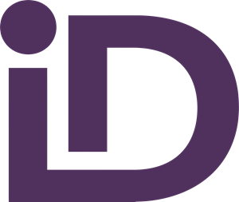

# [ID Bot](https://github.com/chrisdenman/id-bot) 0.0.1
                                                                

A [Discord.js](https://discord.js.org/) bot to that replies to messages that lack suitable image identifiers. 
                     
## Use Cases

- Facilitating inclusivity by promoting descriptions for all message image attachments.
- Increases the meaningful contextual lifetime of images. 

## Running Locally

A working version of node is required (Tested on `v21.6.2`).

### Required Environment Variables
- `id_bot_id` must be set to the bot's client identifier.
- `id_bot_token` must be set to the bot's token. 

`npm run start` - starts the OAuth server and application proper in parallel.

## QA

### Tests

`npm run test`
- Test reports are located [here](build/tests/html/vitest.html).
- Coverage reports are located [here](build/tests/coverage/index.html).

### Linting

`npm run lint`

## Production Plugins

- `discord.js`
- `express`
- `discord-api-types`
                         
## Discord Application Intents Required

- `bot`
- `messages.read`
- `guilds`

## Discord Permissions Required

- Send Messages
- ~~Send Messages in Threads~~

## Version History

See [Version History](./VERSIONS.md)

## Licensing

The [Unlicense](https://unlicense.org/)

## Resources Used

- [discord.js](https://discord.js.org/)
- [JAVASCRIPT.INFO](https://javascript.info/)
- [Node](https://nodejs.org/en)
- [mdn web docs : JavaScript](https://developer.mozilla.org/en-US/docs/Web/javascript)
- [Vitest](https://vitest.dev/)
- [stackoverflow](https://stackoverflow.com/)
- [Unicode® Technical Standard #51 : Unicode Emoji](https://www.unicode.org/reports/tr51/)
- [The OAuth 2.0 Authorization Framework](https://www.rfc-editor.org/rfc/rfc6749)
